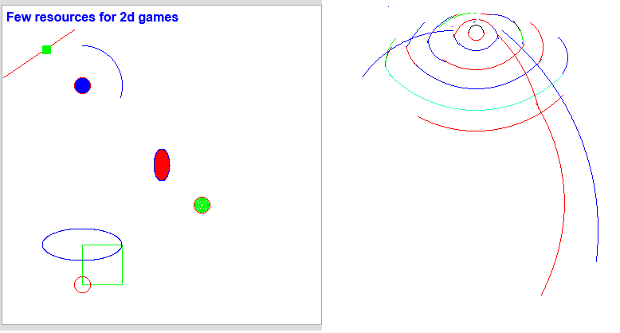

# graphics.js

Set of tools to draw **straight lines**, **circles**, **arcs**, **boxed areas**(**squares** or **rectangles**), **ellipses** and **region fillers**... 

I got interested in writing this little JS library, while reading a **Schaum Outline Series book on Computer Graphics** and here is the (link)[https://www.abebooks.com/9780070503267/Schaums-Outline-Computer-Graphics-GORDON-0070503265/plp] to it. 

### TODO

The reimplementation of "Fixed memory method"(right-hand fill method) to fill a region is still WIP(Work In Process).
I'm following pseudo-code from this wikipedia document... http://en.wikipedia.org/wiki/Flood_fill

 
